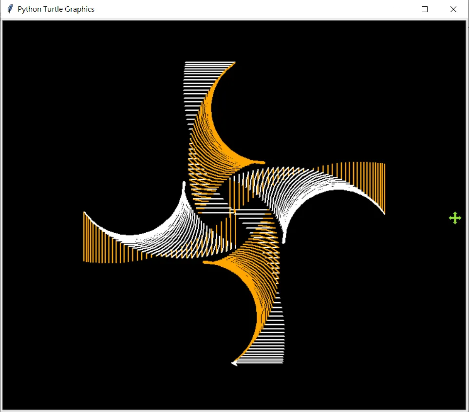

# Turtle Graphic應用
---
## 繪製螺旋狀的幾何圖案

```python
from turtle import *

# 初始化設定
setposition(-60, 0)  # 設定起始位置
speed(0)             # 最快繪圖速度
bgcolor("black")     # 黑色背景
colors = ["orange", "white"]  # 交替顏色
pensize(2)           # 畫筆粗細

# 繪製螺旋圖案
for i in range(150):
    color(colors[i % 2])  # 交替使用顏色
    right(i)              # 逐漸增加右轉角度
    circle(90, i)         # 繪製漸變圓弧
    penup()               # 抬筆移動
    forward(i + 50)       # 不規則前進
    pendown()             # 落筆繪圖
    right(90)             # 固定右轉90度
    forward(i - 65)       # 動態長度直線
    hideturtle()          # 隱藏烏龜圖標

# 完成繪圖
done()
```
