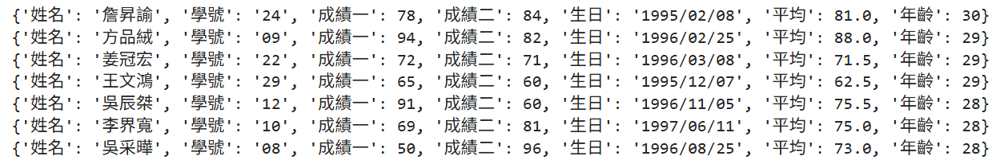
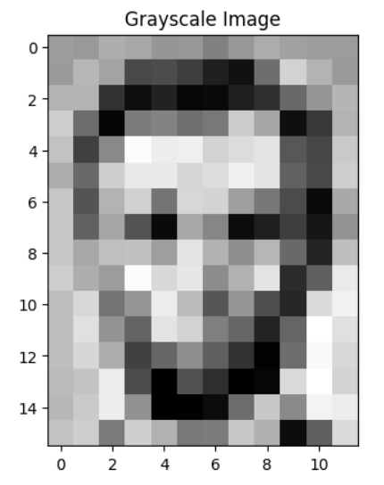
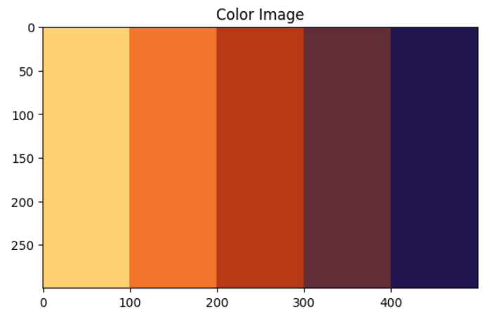
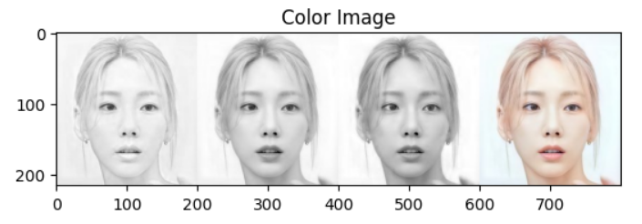
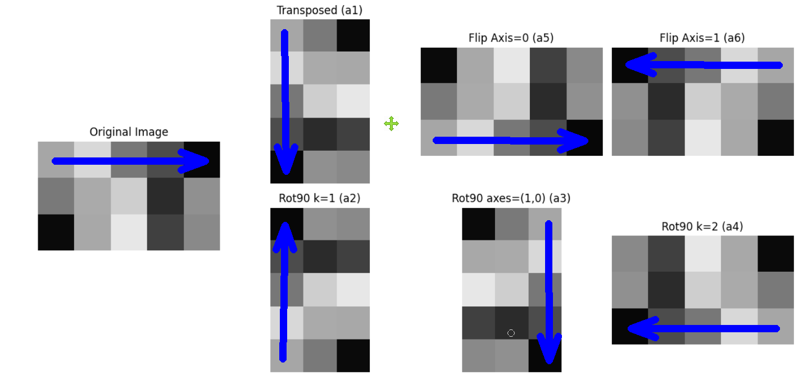
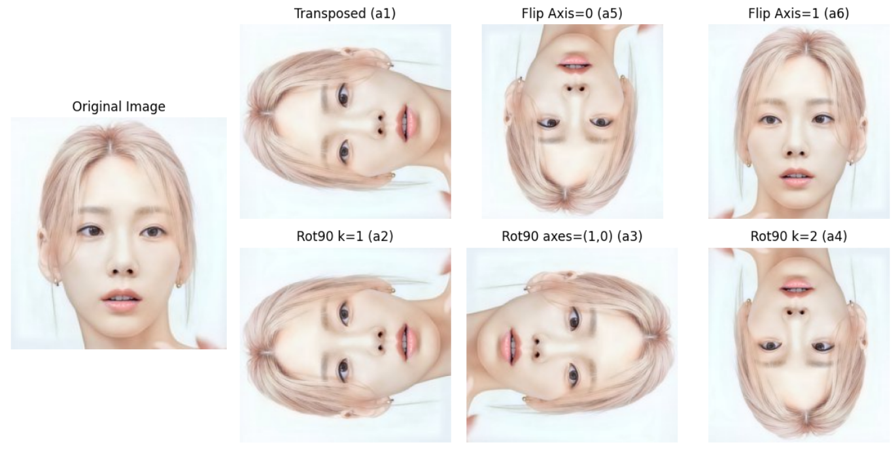

# 大數據分析基本應用
---
## 字串解析並存入字典結構

```python
import datetime

f = open('學生資料表.txt', 'r', encoding="big5")
# print(type(f)) # <class '_io.TextIOWrapper'>
# print(dir(f))
data_string = f.read() # 變成一個很大的字串
# print(repr(a))
f.close()

# 利用跳行轉義字符\n切割字串
lines = data_string.split('\n')
# print(lines)

# 创建字典列表
students = []
for line in lines:
    if line.strip():  # 如果是空行就跳過
        parts = line.split()
        # 处理姓名可能包含空格的情况（虽然本例中没有）
        # 假设格式固定为：姓名 学号 成绩一 成绩二 生日
        name = parts[0]
        student_id = parts[1]
        score1 = int(parts[2])
        score2 = int(parts[3])
        birthday = parts[4]

        student = {
            '姓名': name,
            '學號': student_id,
            '成績一': score1,
            '成績二': score2,
            '生日': birthday
        }
        students.append(student)

# 動態新增平均成績欄位
for student in students:
    student['平均'] = ( student['成績一'] + student['成績二'] ) / 2
    #print(student)

# 動態新增年齡欄位
for student in students:
    # step1. 把生日字串變成日期結構  'strftime'日期變字串, 'strptime'字串變日期
    我的生日 = datetime.datetime.strptime(student['生日'],'%Y/%m/%d')
    # step2. 得到今天日期結構
    今天日期 = datetime.datetime.now()
    # step3. 算年齡
    age = 今天日期.year - 我的生日.year
    # step4. 如果生日還沒過  年齡要減一
    if 今天日期 < datetime.datetime(今天日期.year,我的生日.month,我的生日.day) :
        age -= 1
    student['年齡'] = age

a = sorted(students,key=lambda x:(x['年齡'], x['平均']),reverse=True)
for student in a:
    print(student)
```
## Numpy-灰階影像輸出

```python
import matplotlib.pyplot as plt
import numpy as np

# 轉換為 NumPy 陣列，並指定為 uint8 類型（0-255）
array = np.array(s, dtype=np.uint8)

# 顯示灰階圖像
plt.imshow(array, cmap='gray', vmin=0, vmax=255)  # cmap='gray' 指定灰階
plt.title("Grayscale Image")
plt.show()
```
---
## Numpy-色階輸出

```python
hex_color = ["#FED172","#F3742B","#B83A14","#612E37","#231650"]

rgb_color = []
for item in hex_color :
    # 去除 # 並拆分通道
    r = int(item[1:3], 16)  # 紅色
    g = int(item[3:5], 16)  # 綠色
    b = int(item[5:7], 16)  # 藍色
    rgb_color.append((r, g, b))
    
arr = np.empty((300,500,3), dtype=np.uint8)
arr[ : ,     : 100 , : ] = rgb_color[0]
arr[ : , 100 : 200 , : ] = rgb_color[1]
arr[ : , 200 : 300 , : ] = rgb_color[2]
arr[ : , 300 : 400 , : ] = rgb_color[3]
arr[ : , 400 :     , : ] = rgb_color[4]

import matplotlib.pyplot as plt

# 顯示灰階圖像
plt.imshow(arr, vmin=0, vmax=255)  
plt.title("Color Image")
plt.show()
```
---

## Numpy-影像色階輸出

```python
# 利用numpy的陣列結構顯示彩色影像

from PIL import Image
import numpy as np

arr = Image.open('face10.jpg')

# 轉換為 NumPy 陣列，並指定為 uint8 類型（0-255）
array = np.array(arr, dtype=np.uint8)

arr_r = np.empty(array.shape, dtype=np.uint8)
arr_r[:,:,0] =  array[:,:,0]
arr_r[:,:,1] =  array[:,:,0]
arr_r[:,:,2] =  array[:,:,0]

arr_g = np.empty(array.shape, dtype=np.uint8)
arr_g[:,:,0] =  array[:,:,1]
arr_g[:,:,1] =  array[:,:,1]
arr_g[:,:,2] =  array[:,:,1]

arr_b = np.empty(array.shape, dtype=np.uint8)
arr_b[:,:,0] =  array[:,:,2]
arr_b[:,:,1] =  array[:,:,2]
arr_b[:,:,2] =  array[:,:,2]

a1 = np.concatenate((arr_r,arr_g,arr_b,array),axis=1)

import matplotlib.pyplot as plt

# 顯示灰階圖像
plt.imshow(a1, vmin=0, vmax=255)  
plt.title("Color Image")
plt.show()
```
---

## Numpy-陣列轉置

```python
import numpy as np
import matplotlib.pyplot as plt

# 隨機生成一個 3x5 的 uint8 陣列
# arr = np.random.randint(256, size=(3, 5), dtype=np.uint8)

from PIL import Image

# 讀取彩色影像
array = Image.open('643458.jpg')

# 方法 1: 使用 convert('L') 直接轉灰階
gray_img = array.convert('L')  # 'L' 表示 8-bit 灰階
arr= np.array(gray_img, dtype=np.uint8)  # 轉為 NumPy 陣列

# 定義各種變換
a1 = arr.T                     # 轉置
a2 = np.rot90(arr, k=1)        # 預設逆時旋轉 90 度 (axes=(0,1))
a3 = np.rot90(arr, k=1, axes=(1, 0))  # 順時旋轉 90 度 (axes=(1,0))
a4 = np.rot90(arr, k=2)        # 旋轉 180 度
a5 = np.flip(arr, axis=0)      # 上下翻轉
a6 = np.flip(arr, axis=1)      # 左右翻轉

# 設定畫布大小
plt.figure(figsize=(12, 6))

# --- 原圖 (占用位置 1 ) ---
# ax_original = plt.subplot(2, 4, 1)
# ax_original.imshow(arr, cmap='gray', vmin=0, vmax=255)
# ax_original.set_title("Original Image")
# ax_original.axis('off')

# 由於 subplot(2,4,5) 會放在第二列第一行，我們讓它空白（或合併）
# 這裡直接讓原圖佔用位置 1，並在視覺上延伸（但實際不佔用 5）
# 或者改用 subplot2grid 更精確控制

# --- 改用 subplot2grid 精確控制 ---
plt.subplot2grid((2, 4), (0, 0), rowspan=2)  # 原圖佔用 (0,0) 和 (1,0)
plt.imshow(arr, cmap='gray', vmin=0, vmax=255)
plt.title("Original Image")
plt.axis('off')

# --- a1 (轉置) -> 位置 2 ---
plt.subplot(2, 4, 2)
plt.imshow(a1, cmap='gray', vmin=0, vmax=255)
plt.title("Transposed (a1)")
plt.axis('off')

# --- a5 (上下翻轉) -> 位置 3 ---
plt.subplot(2, 4, 3)
plt.imshow(a5, cmap='gray', vmin=0, vmax=255)
plt.title("Flip Axis=0 (a5)")
plt.axis('off')

# --- a6 (左右翻轉) -> 位置 4 ---
plt.subplot(2, 4, 4)
plt.imshow(a6, cmap='gray', vmin=0, vmax=255)
plt.title("Flip Axis=1 (a6)")
plt.axis('off')

# --- a2 (旋轉 90 度) -> 位置 6 ---
plt.subplot(2, 4, 6)
plt.imshow(a2, cmap='gray', vmin=0, vmax=255)
plt.title("Rot90 k=1 (a2)")
plt.axis('off')

# --- a3 (旋轉 90 度 axes=(1,0)) -> 位置 7 ---
plt.subplot(2, 4, 7)
plt.imshow(a3, cmap='gray', vmin=0, vmax=255)
plt.title("Rot90 axes=(1,0) (a3)")
plt.axis('off')

# --- a4 (旋轉 180 度) -> 位置 8 ---
plt.subplot(2, 4, 8)
plt.imshow(a4, cmap='gray', vmin=0, vmax=255)
plt.title("Rot90 k=2 (a4)")
plt.axis('off')

# 自動調整佈局
plt.tight_layout()
plt.show()
```
---

```python
import numpy as np
import matplotlib.pyplot as plt
from PIL import Image

# 讀取彩色影像
array = Image.open('face10.jpg')
arr= np.array(array, dtype=np.uint8)  # 轉為 NumPy 陣列

# 定義各種變換
a1 = arr.T                                  # 轉置
a1 = np.transpose(a1, (1, 2, 0))
a2 = np.rot90(arr, k=1, axes=(0, 1))        # 預設逆時旋轉 90 度 (axes=(0,1))
a3 = np.rot90(arr, k=1, axes=(1, 0))        # 順時旋轉 90 度 (axes=(1,0))
a4 = np.rot90(arr, k=2, axes=(0, 1))        # 旋轉 180 度
a5 = np.flip(arr, axis=0)                   # 上下翻轉
a6 = np.flip(arr, axis=1)                   # 左右翻轉

# 設定畫布大小
plt.figure(figsize=(12, 6))

# --- 原圖 (占用位置 1 ) ---
# ax_original = plt.subplot(2, 4, 1)
# ax_original.imshow(arr, cmap='gray', vmin=0, vmax=255)
# ax_original.set_title("Original Image")
# ax_original.axis('off')

# 由於 subplot(2,4,5) 會放在第二列第一行，我們讓它空白（或合併）
# 這裡直接讓原圖佔用位置 1，並在視覺上延伸（但實際不佔用 5）
# 或者改用 subplot2grid 更精確控制

# --- 改用 subplot2grid 精確控制 ---
plt.subplot2grid((2, 4), (0, 0), rowspan=2)  # 原圖佔用 (0,0) 和 (1,0)
plt.imshow(arr, vmin=0, vmax=255)
plt.title("Original Image")
plt.axis('off')

# --- a1 (轉置) -> 位置 2 ---
plt.subplot(2, 4, 2)
plt.imshow(a1, vmin=0, vmax=255)
plt.title("Transposed (a1)")
plt.axis('off')

# --- a5 (上下翻轉) -> 位置 3 ---
plt.subplot(2, 4, 3)
plt.imshow(a5, vmin=0, vmax=255)
plt.title("Flip Axis=0 (a5)")
plt.axis('off')

# --- a6 (左右翻轉) -> 位置 4 ---
plt.subplot(2, 4, 4)
plt.imshow(a6, vmin=0, vmax=255)
plt.title("Flip Axis=1 (a6)")
plt.axis('off')

# --- a2 (旋轉 90 度) -> 位置 6 ---
plt.subplot(2, 4, 6)
plt.imshow(a2, vmin=0, vmax=255)
plt.title("Rot90 k=1 (a2)")
plt.axis('off')

# --- a3 (旋轉 90 度 axes=(1,0)) -> 位置 7 ---
plt.subplot(2, 4, 7)
plt.imshow(a3, vmin=0, vmax=255)
plt.title("Rot90 axes=(1,0) (a3)")
plt.axis('off')

# --- a4 (旋轉 180 度) -> 位置 8 ---
plt.subplot(2, 4, 8)
plt.imshow(a4, vmin=0, vmax=255)
plt.title("Rot90 k=2 (a4)")
plt.axis('off')

# 自動調整佈局
plt.tight_layout()
plt.show()
```
## Tidy Data
