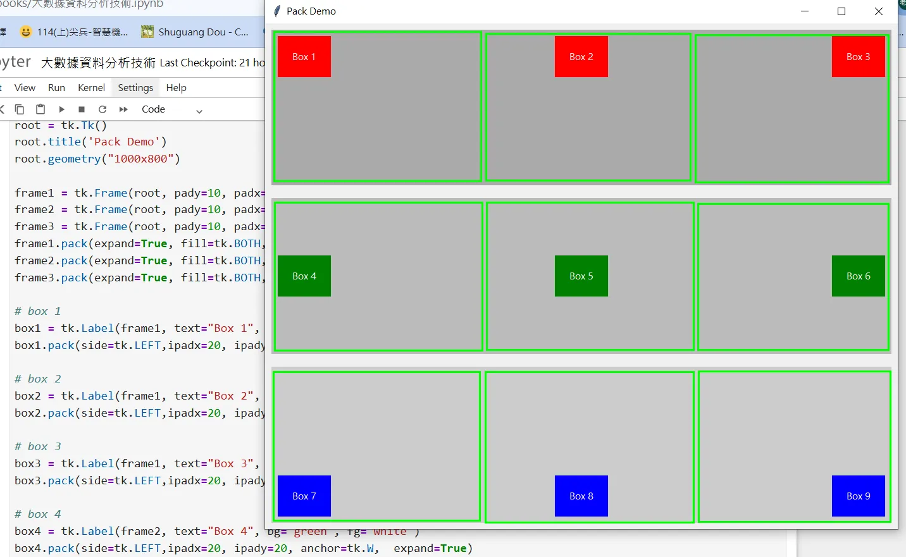

# TKinter基本運用
---

## Pack物件佈局

```python
import tkinter as tk

root = tk.Tk()
root.title('Pack Demo')
root.geometry("1000x800")

frame1 = tk.Frame(root, pady=10, padx=10, bg='#aaaaaa')   # 第一個 Frame 元件
frame2 = tk.Frame(root, pady=10, padx=10, bg='#bbbbbb')   # 第二個 Frame 元件
frame3 = tk.Frame(root, pady=10, padx=10, bg='#cccccc')   # 第三個 Frame 元件
frame1.pack(expand=True, fill=tk.BOTH, padx=10, pady=10  )
frame2.pack(expand=True, fill=tk.BOTH, padx=10, pady=10  )
frame3.pack(expand=True, fill=tk.BOTH, padx=10, pady=10  )

# box 1
box1 = tk.Label(frame1, text="Box 1", bg="red", fg="white")
box1.pack(side=tk.LEFT, ipadx=20, ipady=20, anchor=tk.NW,  expand=True)

# box 2
box2 = tk.Label(frame1, text="Box 2", bg="red", fg="white")
box2.pack(side=tk.LEFT, ipadx=20, ipady=20, anchor=tk.N, expand=True)

# box 3
box3 = tk.Label(frame1, text="Box 3", bg="red", fg="white")
box3.pack(side=tk.LEFT, ipadx=20, ipady=20, anchor=tk.NE, expand=True)

# box 4
box4 = tk.Label(frame2, text="Box 4", bg="green", fg="white")
box4.pack(side=tk.LEFT, ipadx=20, ipady=20, anchor=tk.W,  expand=True)

# box 5
box5 = tk.Label(frame2, text="Box 5", bg="green", fg="white")
box5.pack(side=tk.LEFT, ipadx=20, ipady=20, anchor=tk.CENTER, expand=True)

# box 6
box6 = tk.Label(frame2, text="Box 6", bg="green", fg="white")
box6.pack(side=tk.LEFT, ipadx=20, ipady=20, anchor=tk.E, expand=True)

# box 7
box7 = tk.Label(frame3, text="Box 7", bg="blue", fg="white")
box7.pack(side=tk.LEFT, ipadx=20, ipady=20, anchor=tk.SW,  expand=True)

# box 8
box8 = tk.Label(frame3, text="Box 8", bg="blue", fg="white")
box8.pack(side=tk.LEFT, ipadx=20, ipady=20, anchor=tk.S, expand=True)

# box 9
box9 = tk.Label(frame3, text="Box 9", bg="blue", fg="white")
box9.pack(side=tk.LEFT, ipadx=20, ipady=20, anchor=tk.SE, expand=True)


root.mainloop()
```
---

